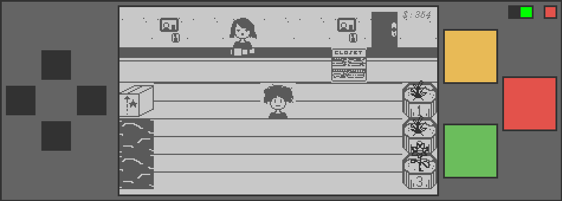
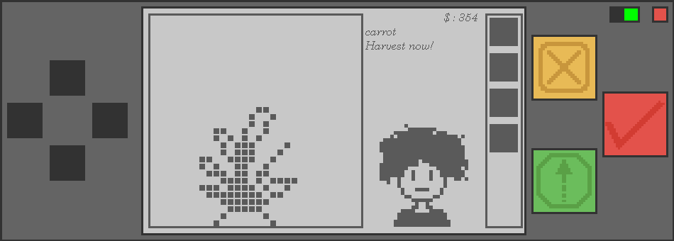
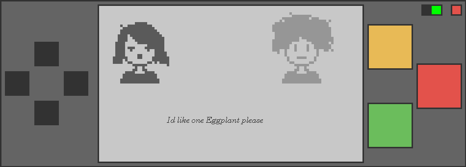
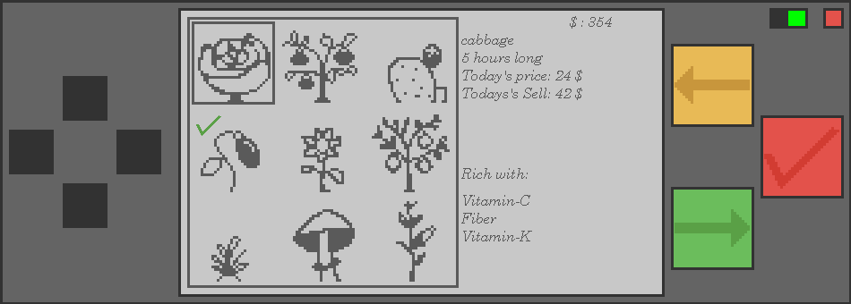
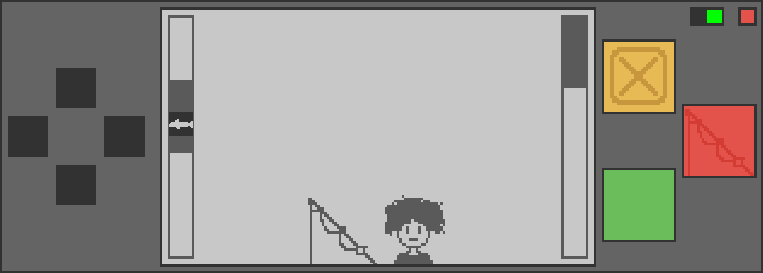

# Floragachi

A Tamagotchi style game, except you raise plants instead of a pet.

It runs in a small always on top window that sits on your desktop while you do other
things. You water your pots, wait for crops to grow, sell them, take orders from
customers, and go fishing when you need quick money. If you forget about a plant for
too long it dries out and dies, so it wants you to check in on it now and then.

Everything you see is drawn as pixels by hand. There are no image files in the game at
all, apart from the window icon.

## Screenshots

The shop floor. You walk around here, between the pots on the right, the pond and the
upgrade box on the left, and the customer waiting at the counter.



Tending a pot. The bar on the right is how much water is left, and this carrot is ready
to pull up.



A customer placing an order. Grow the crop they ask for and you get a large tip on top
of the usual sale.



The seed shop. Every crop shows its grow time, price and payout, and the tick marks
whichever one the current customer wants.



The fishing minigame. Keep the rod over the fish to fill the meter on the right.



## About the art

All of the sprites were made in **Pixies**, a pixel art engine and editor I built
myself. Pixies is also written entirely in Java, same as this game.

Pixies saves its work as `.rona` files, which is the format this game loads directly.
A `.rona` file is just plain text: a small header, then a long run of numbers, one per
pixel. Every sprite is a 30x30 grid, so that is 900 numbers per frame. A `0` means the
pixel is filled in, anything else is treated as background.

Because the game reads the editor's own format, sprites can be redrawn in Pixies and
dropped straight back into the folder with no conversion step.

## What is in the game

- **Three pots** you can grow in at the same time, each with its own crop and water level
- **Nine crops** to buy, with different grow times, prices and payouts
- **Watering and withering**, so plants need attention or you lose them
- **Customers** who ask for a specific crop and tip well when you deliver it
- **Six upgrades** that get more expensive as you buy them
- **A fishing minigame** for quick cash between harvests
- **Character customization** for your shopkeeper
- **Offline growth**, so plants keep growing while the game is closed

## Running it

You need Java 17 or newer.

```bash
javac -d bin src/module-info.java src/planagochi/*.java
```

```bash
java -cp bin planagochi.starter
```

Run it from the project folder. The `.rona` files and the logo are loaded from the
current working directory, so starting the game from somewhere else will just show an
"Assets missing" message.

## Controls

The window has no title bar. Drag any empty part of it to move it around.

**Mouse**

| Control | What it does |
|---|---|
| Three round buttons on the right | The main actions, they change per screen |
| Arrow pad on the left | Move around, or scroll through menus |
| Green square, top right | Toggle always on top |
| Red square, top right | Save and quit |

**Keyboard**

| Key | What it does |
|---|---|
| `W` `A` `S` `D` | Same as the arrow pad |
| `I` | Top right button |
| `M` | Bottom right button |
| `K` or `L` | Middle button |
| `V` | Open the tutorial |

There are also three debug keys still in the code (`P` drains water, `[` and `]` move
growth backwards and forwards). They are grouped together in `keyTyped` and marked with
a comment so they are easy to strip out later.

## How a round plays out

Walk over to a pot and press the middle button to water it, or to harvest it once it is
grown. Selling a crop opens the shop, where you buy the next seed. The customer standing
at the counter always wants one specific crop, marked with a tick in the shop grid, and
growing that one pays a large bonus on top of the sale.

If you are short on money, the pond on the left is the fastest way to earn some. Lift the
rod with the middle button and keep it over the fish to fill the meter.

The upgrade booth is next to the pond. Upgrades make plants dry out slower, grow faster,
sell for more, or occasionally cost nothing at all.

## Files

| Path | What it is |
|---|---|
| `src/planagochi/starter.java` | Entry point |
| `src/planagochi/MainPage.java` | The window |
| `src/planagochi/GamePage.java` | The whole game: drawing, input, timing, saving |
| `src/planagochi/Plant.java` | One crop, with a sprite per growth stage |
| `src/planagochi/features.java` | One single frame sprite |
| `p0.rona` to `p8.rona` | The nine crops |
| `cosms.rona` | Hair, shirts, eyes and mouths, five of each |
| `Icons.rona` | The glyphs drawn on the buttons |
| `Furniture.rona` | Room tiles |
| `Fishin.rona` | Fish |
| `floralogo.png` | Window icon, the only image file in the project |
| `SaveProg.ronasave` | Your save |

## Saves

`SaveProg.ronasave` is a single line of plain numbers. The game writes it when you quit,
when you buy or sell something, and automatically once a minute.

The format grew over time, so the first 25 numbers are the original ones and anything
after that was added later. Older saves still load fine, the newer values just fall back
to their defaults. If the file is missing or damaged the game starts a fresh run instead
of crashing.

Deleting the file is how you start over.
